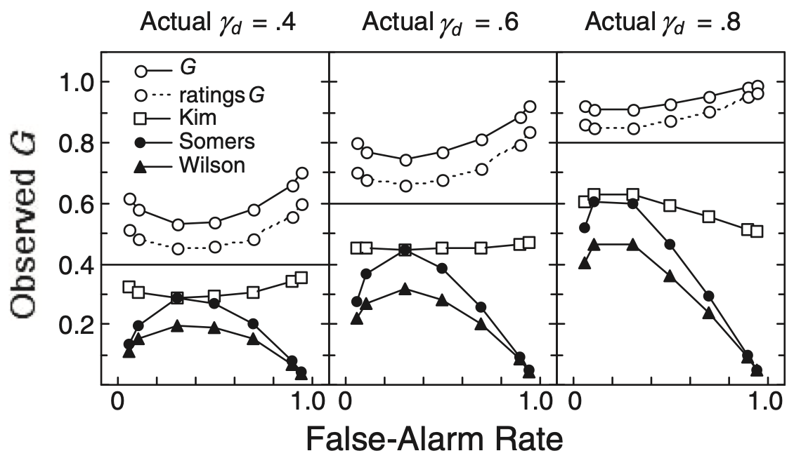

```{r}
#| echo: false
library(tidyverse)
library(hmetad)
library(distributional)
library(ggdist)
library(paletteer)
library(patchwork)

ALPHA <- .33
PALETTE <- paletteer_d("fishualize::Phractocephalus_hemioliopterus")[c(1, 3)]
DIST_COLOR <- paletteer_d("fishualize::Phractocephalus_hemioliopterus")[4]
DELTA_COLOR <- paletteer_d("fishualize::Phractocephalus_hemioliopterus")[2]

THEME_SDT <- function(xlab='Evidence', limits=c(-2.5, 2.5), base_size=18,
                      expand=expansion(mult=c(.1, .1))) {
  list(scale_x_continuous(xlab, limits=limits, breaks=seq(-4, 4, by=2), expand=expand),
       scale_color_manual('Stimulus', values=PALETTE),
       scale_fill_manual('Stimulus', values=PALETTE),
       scale_y_continuous(expand=c(0, 0)),
       theme_classic(base_size=base_size),
       theme(axis.title.y=element_blank(),
             axis.text.y=element_blank(),
             axis.ticks.y=element_blank(),
             axis.line.y=element_blank()))
}

```

# What is metacognition? { .dark }


## Thinking about thinking 

:::{.r-stack}
::::{.fragment .center-flex}
```{.tikz height=450}
%%| filename: meta_1
%%| additionalPackages: \usepackage{cmbright}
\include{tikz_header.tex}
\begin{tikzpicture}
    \node [ellipse, minimum width=2cm] (object) { object };
    \node [hidden, ellipse, minimum width=2cm] (meta) [above = 0.5cm of object] { meta };
	\path[hidden, ->, draw] (object) edge[out=45, in=315] (meta);
	\path[hidden, ->, draw] (meta) edge[out=225, in=135] (object);
\end{tikzpicture}
```
::::

::::{.fragment .center-flex}
```{.tikz height=450}
%%| filename: meta_2
%%| additionalPackages: \usepackage{cmbright}
\include{tikz_header.tex}
\begin{tikzpicture}
    \node [ellipse, minimum width=2cm] (object) { object };
    \node [ellipse, minimum width=2cm] (meta) [above = 0.5cm of object] { meta };
	\path[hidden, ->, draw] (object) edge[out=45, in=315] (meta);
	\path[hidden, ->, draw] (meta) edge[out=225, in=135] (object);
\end{tikzpicture}
```
::::

::::{.fragment .center-flex}
```{.tikz height=450}
%%| filename: meta_3
%%| additionalPackages: \usepackage{cmbright}
\include{tikz_header.tex}
\begin{tikzpicture}
    \node [ellipse, minimum width=2cm] (object) { object };
    \node [ellipse, minimum width=2cm] (meta) [above = 0.5cm of object] { meta };
	\path[->, draw] (object) edge[out=45, in=315] 
        node[unboxed, anchor=west, align=left, scale=0.5] {metacognitive\\monitoring} (meta);
	\path[hidden, ->, draw] (meta) edge[out=225, in=135] 
        node[unboxed, anchor=east, align=right, scale=0.5] {metacognitive\\control} (object);
\end{tikzpicture}
```
::::

::::{.fragment .center-flex}
```{.tikz height=450}
%%| filename: meta_4
%%| additionalPackages: \usepackage{cmbright}
\include{tikz_header.tex}
\begin{tikzpicture}
    \node [ellipse, minimum width=2cm] (object) { object };
    \node [ellipse, minimum width=2cm] (meta) [above = 0.5cm of object] { meta };
	\path[->, draw] (object) edge[out=45, in=315] 
        node[unboxed, anchor=west, align=left, scale=0.5] {metacognitive\\monitoring} (meta);
	\path[->, draw] (meta) edge[out=225, in=135] 
        node[unboxed, anchor=east, align=right, scale=0.5] {metacognitive\\control} (object);
\end{tikzpicture}
```
::::
:::


## Hierarchies of metacognition

:::{.fragment}
{.center-horizontally}
:::


## Type 1 and type 2 decisions
:::{.r-stack height=600}

::::{.fragment .center-flex}
```{.tikz width=1000}
%%| filename: type1type2_1
%%| additionalPackages: \usepackage{cmbright}
\include{tikz_header.tex}
\begin{tikzpicture}
	\node[image] (stimulus) { \includegraphics[width=1cm]{figures/gabor.png} };
	\node[hidden] (response) [right = of stimulus] {
		Direction? \\ 
		L \hspace{.25em} R
	};
	\node[hidden] (confidence) [right = of response] { 
		Confidence? \\
		1 \hspace{.1em} 2 \hspace{.1em} 3 \hspace{.1em} 4 
	};
	\path[hidden] (stimulus) edge (response);
	\path[hidden] (response) edge (confidence);
    
    \node[unboxed, hidden] (type1) [below = 0.5cm of response] { Type 1 \\ Decision };
    \node[unboxed, hidden] (type2) [below = 0.5cm of confidence] { Type 2 \\ Decision };
\end{tikzpicture}
```
::::

::::{.fragment .center-flex}
```{.tikz width=1000}
%%| filename: type1type2_2
%%| additionalPackages: \usepackage{cmbright}
\include{tikz_header.tex}
\begin{tikzpicture}
	\node[image] (stimulus) { \includegraphics[width=1cm]{figures/gabor.png} };
	\node (response) [right = of stimulus] {
		Direction? \\ 
		L \hspace{.25em} R
	};
	\node[hidden] (confidence) [right = of response] { 
		Confidence? \\
		1 \hspace{.1em} 2 \hspace{.1em} 3 \hspace{.1em} 4 
	};
	\path (stimulus) edge (response);
	\path[hidden] (response) edge (confidence);
    
    \node[unboxed, hidden] (type1) [below = 0.5cm of response] { Type 1 \\ Decision };
    \node[unboxed, hidden] (type2) [below = 0.5cm of confidence] { Type 2 \\ Decision };
\end{tikzpicture}
```
::::

::::{.fragment .center-flex}
```{.tikz width=1000}
%%| filename: type1type2_3
%%| additionalPackages: \usepackage{cmbright}
\include{tikz_header.tex}
\begin{tikzpicture}
	\node[image] (stimulus) { \includegraphics[width=1cm]{figures/gabor.png} };
	\node (response) [right = of stimulus] {
		Direction? \\ 
		L \hspace{.25em} R
	};
	\node (confidence) [right = of response] { 
		Confidence? \\
		1 \hspace{.1em} 2 \hspace{.1em} 3 \hspace{.1em} 4 
	};
	\path (stimulus) edge (response);
	\path (response) edge (confidence);
    
    \node[unboxed, hidden] (type1) [below = 0.5cm of response] { Type 1 \\ Decision };
    \node[unboxed, hidden] (type2) [below = 0.5cm of confidence] { Type 2 \\ Decision };
\end{tikzpicture}
```
::::

::::{.fragment .center-flex}
```{.tikz width=1000}
%%| filename: type1type2_4
%%| additionalPackages: \usepackage{cmbright}
\include{tikz_header.tex}
\begin{tikzpicture}
	\node[image] (stimulus) { \includegraphics[width=1cm]{figures/gabor.png} };
	\node (response) [right = of stimulus] {
		Direction? \\ 
		L \hspace{.25em} R
	};
	\node (confidence) [right = of response] { 
		Confidence? \\
		1 \hspace{.1em} 2 \hspace{.1em} 3 \hspace{.1em} 4 
	};
	\path (stimulus) edge (response);
	\path (response) edge (confidence);
    
    \node[unboxed] (type1) [below = 0.5cm of response] { Type 1 \\ Decision };
    \node[unboxed] (type2) [below = 0.5cm of confidence] { Type 2 \\ Decision };
\end{tikzpicture}
```
::::
:::

## Type 1 and type 2 decisions

<br>

::: {.columns }

:::: { .column .dark .box .much-smaller width="40%"}
### Type 1

Decision about the world

::::: {.incremental .much-smaller}
- Is there a stimulus present?
- Are the dots moving left or right?
- Have I seen this image before?
:::::
::::

:::: {.column width="10%"}

::::

:::: { .column .fragment .dark .box .much-smaller width="40%"}
### Type 2

Decision about yourself
 
::::: {.incremental .much-smaller}
- Was my decision correct?
- How good am I at this task?
- Have I been paying attention?
:::::
::::

:::

::: { .tiny .right .bottom}
@clarke1959
:::


## Quantifying type 1 decisions
To understand how well someone performs a task, why not just calculate:

:::{.incremental .smaller}
- % correct?
- correlation(stimulus, response)?
:::

:::{.fragment}
:::{.center-horizontally}
**Need to control for response bias!**
::::
:::


## Quantifying type 1 decisions

:::{.columns}
::::{.column width="40%" .fragment .dark .box .much-smaller}
### Sensitivity ($d'$)

How much do responses distinguish between stimuli?
::::

::::{.column width="10%"}

::::

::::{.column width="40%" .fragment .dark .box .much-smaller}
### Response Bias ($c$)

Is one response more likely overall?
::::
:::

:::{.tiny}
<br>
:::

:::{.r-stack}
::::{.fragment}
```{r}
#| fig-width: 8
#| fig-height: 3
evidence <- tibble(stimulus=factor(0:1),
                   d_prime=1.5, c=0.5, meta_d_prime=1,
                   mu1=c(-1, 1)*d_prime/2, sd=1,
                   mu2=c(-1, 1)*meta_d_prime/2)

p <- ggplot(evidence, aes(xdist=dist_normal(mu1, sd))) +
  stat_slab(aes(fill=stimulus), color=NA, alpha=ALPHA, scale=.8, show.legend=FALSE) +
  THEME_SDT(xlab='Type 1 Evidence', expand=expansion())
p
```
::::

::::{.fragment}
```{r}
#| fig-width: 8
#| fig-height: 3
p <- p + geom_errorbar(aes(x=x, y=y, xmin=x, xmax=xend), inherit.aes=FALSE, width=.05,
                  data=tibble(x=-evidence$d_prime[1]/2, xend=evidence$d_prime[1]/2, y=.8)) +
  geom_text(aes(x=x, y=y, label=label), inherit.aes=FALSE,
            data=tibble(x=0, y=.925, label="d'"))
p
```
::::

::::{.fragment}
```{r}
#| fig-width: 8
#| fig-height: 3
p <- p + geom_vline(aes(xintercept=c)) +
  geom_text(aes(x=x, y=y, label=label), inherit.aes=FALSE,
            data=tibble(x=evidence$c[1]+.15, y=.2, label="c"))
p
```
::::

::::{.fragment}
```{r}
#| fig-width: 8
#| fig-height: 3
p <- p + geom_text(aes(x=x, y=y, label=label), inherit.aes=FALSE,
                   data=tibble(x=evidence$c[1]-1, y=.2, label="R=0"), color=PALETTE[1]) +
  geom_text(aes(x=x, y=y, label=label), inherit.aes=FALSE,
            data=tibble(x=evidence$c[1]+1, y=.2, label="R=1"), color=PALETTE[2])
p
```
::::
:::

::: { .tiny .right .bottom}
@green1966
:::


## Quantifying type 2 decisions
:::{.columns}
::::{.column width="40%" .fragment .dark .box .much-smaller}
#### Metacognitive sensitivity

How much does distinguish between correct and incorrect decisions?
::::

::::{.column width="10%"}
::::

::::{.column width="40%" .fragment .dark .box .much-smaller}
#### Metacognitive Bias

How much evidence is required to respond with high confidence?
::::
:::

<br>

:::{.much-smaller}
::::{.fragment}
We would like the same dissociation as for type 1 decisions
::::

::::{.fragment}
But now we need to control for type 1 sensitivity and bias!
::::
:::

::: { .tiny .right .bottom}
@fleming2014
:::


# Measures of<br>metacognitive<br>sensitivity {.dark}

## General approach

<br>

:::{.r-stack}
::::{.fragment .fade-in-then-out}
|                  |   Stimulus = 0    | Stimulus = 1 |
|:----------------:|:-----------------:|:------------:|
| **Response = 0** | Correct Rejection |     Miss     |
| **Response = 1** |    False Alarm    |     Hit      |
::::

::::{.fragment}
|                    |   Accuracy = 0      | Accuracy = 1  |
|:------------------:|:-------------------:|:-------------:|
| **Confidence = 0** | Correct Rejection 2 |     Miss 2    |
| **Confidence = 1** |    False Alarm 2    |     Hit 2     |
::::
:::

<br>

:::{.fragment}
Each approach determines metacognitive sensitivity using these probabilities
:::

## Correlational approaches

<br>

:::{.columns .center-flex}

::::{.column style="width: 45%; font-size: 1.5em;" .fragment}
``` python
accuracy = [1, 0, 1, 1, 0, 1, 0, ...]
confidence = [0, 0, 1, 1, 0, 1, 0, ...]

phi = cor(accuracy, confidence)
```
::::

::::{.column width="45%"}
{.fragment}
::::
:::

::: { .tiny .right .bottom}
@fleming2014
:::

## Correlational approaches

#### Pros
:::{.incremental .much-smaller}
- Very smiple, can be used with any design
- Can establish presence (vs. absence) of metacognition
:::

#### Cons {.fragment}
:::{.incremental .much-smaller}
- Confounded by type 1 performance
- Confounded by metacognitive bias
- Requires careful controls to compare between conditions
:::


## Area under type 2 ROC (AUROC2)

:::{.r-stack}

::::{.fragment .fade-in-then-out}
```{r}
#| label: auroc2_hist
#| fig-width: 12
#: fig-height: 4
d <- sim_metad(10000) |>
  group_by(correct) |>
  count(confidence) |>
  complete(tibble(confidence=seq_len(4)), fill=list(n=0)) |>
  mutate(p=n/sum(n))

d.roc2 <- d |>
  pivot_wider(names_from=correct, values_from=n:p) |>
  mutate(p_hit2=1-cumsum(p_1),
         p_fa2=1-cumsum(p_0)) |>
  complete(tibble(confidence=1, p_hit2=1, p_fa2=1))

ROC2_plot <- function(d_conf, d_roc2, k, filter=TRUE) {
  plot.conf <- d_conf |>
    mutate(correct=factor(correct),
           confidence=factor(confidence)) |>
    ggplot(aes(x=confidence, y=p, group=correct, fill=correct)) +
    xlab('Confidence') +
    scale_fill_manual('Correct', values=PALETTE) +
    theme_classic(18, paper=alpha('white', 0)) +
    theme(axis.title.y=element_blank(),
          axis.text.y=element_blank(),
          axis.ticks.y=element_blank(),
          axis.line.y=element_blank())

  plot.roc2 <- d_roc2 |>
    filter(confidence <= k) |>
    ggplot(aes(x=p_fa2, y=p_hit2)) +
    geom_abline(intercept=0, slope=1, linetype='dotted') +
    geom_point() +
    geom_path() +
    coord_fixed(xlim=c(0, 1), ylim=c(0, 1), expand=FALSE) +
    scale_x_continuous('P(Confidence ≥ k | Incorrect)', limits=0:1) +
    scale_y_continuous('P(Confidence ≥ k | Correct)', limits=0:1) +
    theme_bw(18, paper=alpha('white', 0)) +
    theme(panel.grid=element_blank(),
          axis.title.x=element_text(color=PALETTE[1]),
          axis.title.y=element_text(color=PALETTE[2]))
  
  if (filter) {
    plot.conf <- plot.conf +
      geom_vline(xintercept=k+0.5)

    if (k > 0) {
      plot.conf <- plot.conf +
        geom_col(aes(alpha=as.integer(confidence)>k),
             position=position_dodge(.925), show.legend=c(alpha=FALSE)) +
        scale_alpha_discrete(range=c(0.25, 1), breaks=c(0.25, 1))
    }
  }

  if (!filter || k==0) {
    plot.conf <- plot.conf +
      geom_col(position=position_dodge(.925))
  }
  
  (plot.conf | plot.roc2) + plot_layout(widths=c(2, 1))
}

ROC2_plot(d, d.roc2, k=0, filter=FALSE)
```
::::

::::{.fragment .fade-in-then-out}
```{r}
#| label: auroc2_0
#| fig-width: 12
#: fig-height: 4
ROC2_plot(d, d.roc2, k=0)
```
::::


::::{.fragment .fade-in-then-out}
```{r}
#| label: auroc2_1
#| fig-width: 12
#: fig-height: 4
ROC2_plot(d, d.roc2, k=1)
```
::::

::::{.fragment .fade-in-then-out}
```{r}
#| label: auroc2_2
#| fig-width: 12
#: fig-height: 4
ROC2_plot(d, d.roc2, k=2)
```
::::

::::{.fragment .fade-in-then-out}
```{r}
#| label: auroc2_3
#| fig-width: 12
#: fig-height: 4
ROC2_plot(d, d.roc2, k=3)
```
::::

::::{.fragment .fade-in-then-out}
```{r}
#| label: auroc2_4
#| fig-width: 12
#: fig-height: 4
ROC2_plot(d, d.roc2, k=4)
```
::::

:::

## meta-$d'$


## References
